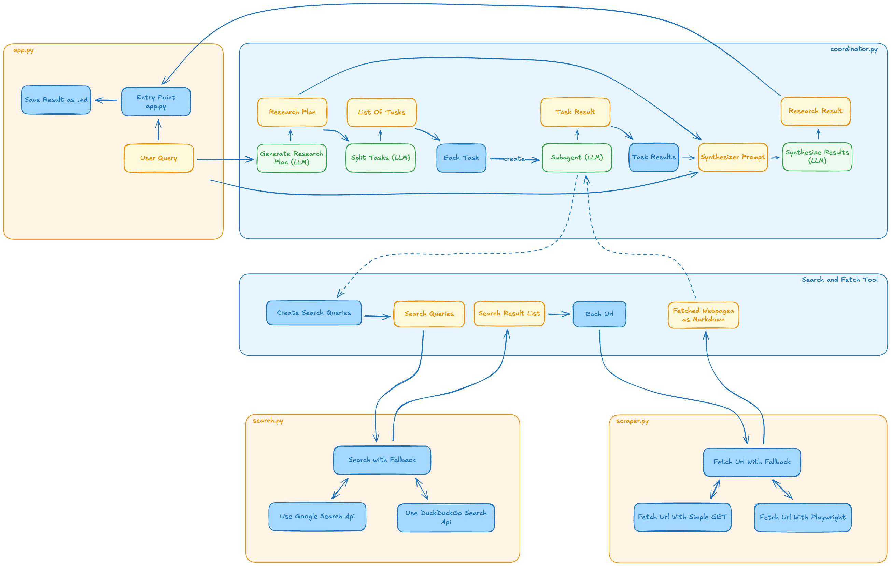

# Simple Fast Multi-Agent Deep Researcher
## Overview

This project implements a **multi‑agent, large‑language‑model–driven research pipeline** designed to answer questions with depth, structure, and evidence. Rather than generating a single monolithic answer, the system explicitly **plans, decomposes, executes, and synthesizes research** in stages, closely mirroring how a human research team would operate.

The result is a **high‑quality Markdown report** grounded in real web sources, structured reasoning, and explicit uncertainty handling. The system is optimized for *quality, traceability, and depth*.    
    
This pipeline uses
- LiteLlm for model inference (Hence you can pretty much use any endpoint you like including local models)
    - Please refer to the [LiteLlm Documentation](https://docs.litellm.ai/docs/) for more information
- a simple Get request or (if necessary) Playwright for webpage scraping
    - Returns markdown (or simple text on failure) using markdownify
- Google Search Api or (on failure) DuckDuckGo Search Api
    - Both are free to use, but you need to keys for the Google Search Api (more on that further down below)
    
The pipeline aims for speed by using concurrent Subagent calls.    
    
**Please note** This pipeline is not intended to be any kind of endproduct but rather a scaffold resp. a starting point.
    
## High‑Level Flow

At a conceptual level, the system runs through four phases:

1. **Planning** – Turn a user’s question into a detailed research plan.
2. **Task Decomposition** – Split the plan into independent subtasks.
3. **Parallel Research** – Run multiple specialized research agents concurrently.
4. **Synthesis** – Integrate all findings into a single coherent report.

Each phase is handled by a different component, with different prompts, constraints, and (optionally) different models.    

## General App Flow
    

    
A more in-depth description can be found here: [description/DESCRIPTION.md](./description/DESCRIPTION.md)    

#
**Please note** This is highly inspired by Alejandro AO's approach:
- Blogpost: [Build a Multi-Agent Deep Research with Open Models + Firecrawl](https://alejandro-ao.com/posts/agents/multi-agent-deep-research/)
    - Youtube Video: [Create an Open Deep Research Multi-Agent in Python (Step by Step)](https://www.youtube.com/watch?v=vHBRmXpDIFY)
- Github Repo: [open-deep-research-w-firecrawl](https://github.com/alejandro-ao/open-deep-research-w-firecrawl)

## Installalation
### Create .env file
You must set some environment variables in order to get everything running.
- First, copy (or rename) env.example to .env
    - The environment variables will be loaded with dotenv in main.py

#### Google Search
You can use the Google Search Api up to a certain rate limit per day for free.    
You can find a nice explanation on how to set it up in this Youtube Video: [Agentic Web Search Guide: Customizable Google Search For AI Agents](https://youtu.be/D9axtT86rls?si=uJVTpjeBipIlV1_p&t=114) (link already skips to the respective timestamp).    
    
You can test the functionality of your Google Search Api setup by simply calling it from your browser:
```
https://www.googleapis.com/customsearch/v1?key=YOUR-GOOGLE-API-KEY&cx=YOUR-GOOGLE-CX-KEY&q=SOME-SEARCH-REQUEST&num=SOME-RESULTS-LIMIT
```
    
Set the envirnment variables for GOOGLE_API_KEY and GOOGLE_CX in .env accordingly. (The GOOGLE_SEARCH_URL is already set.)
```
GOOGLE_API_KEY="AIzaSyATkA3..."
GOOGLE_CX="47110..."
GOOGLE_SEARCH_URL="https://www.googleapis.com/customsearch/v1"
```
    
**Note**: The search has a fallback mechanism to DuckDuckGo in case the Google search fails. (This would include Api failure due to wrong or non-existing keys.) As of now, the usage of the DuckDuckGo Search Api is for free and doesn't require any Api keys. (Although there have been reports on rate limits.)

#### Inference Endpoints
- Every processing step can use a different model inference endpoint, hence the four different "batches" (LLM_COORDINATOR, LLM_SUBAGENT, LLM_PLANNER, LLM_SUBTASKS)
    - You can certainly copy&paste the same endpoint values to each "batch" as long as all variables are set properly.
- The model inference is using [LiteLlm](https://docs.litellm.ai/docs/), hence you should be able to use pretty much every endpoint you like.
    - LiteLlm convention for model id: provider/model-id
    - Examples
    ```
    LLM_PLANNER_MODEL="groq/openai/gpt-oss-120b"
    LLM_PLANNER_BASE_URL="https://api.groq.com/openai/v1"
    LLM_PLANNER_API_KEY="gsk_DBqKF..."
    ```

    If you don't have any custom base url (i.e. when requesting OpenAi), just leave it blank.
    ```
    LLM_PLANNER_MODEL="openai/gpt-5-mini-2025-08-07"
    LLM_PLANNER_BASE_URL=
    LLM_PLANNER_API_KEY="sk-proj-2z1N3KUZkFrR..."
    ```


### Create and run virtual environment
- Create virtual environment (.venv) with ```uv sync```
- Activate and change into virtual environment with ```source .venv/bin/activate```
    - Install playwright with ```playwright install```
- Leave virtual environment with ```deactivate```
- You can simply delete .venv, uv.lock and \_\_pycache\_\_ after usage (and repeat this process)

For more information about uv you may like to read this: [Managing Python Virtual Environments with UV: A Comprehensive Guide](https://medium.com/@vkmauryavk/managing-python-virtual-environments-with-uv-a-comprehensive-guide-ac74d3ad8dff)


## Usage
### Optional: Check planner.py and/or task_splitter.py
If you like to check your endpoints, you can simply call these scripts. 
```
python planner.py 
python task_splitter.py
```
Both scripts can be called from main, executing a test input.    
- planner.py
```python
if __name__ == "__main__":
    research_plan = generate_research_plan(user_query="What is a good pet for a 9 year old kid?")
    print(research_plan)
```
- task_splitter.py
```python
if __name__ == "__main__":
    with open("example-results/1_research_plan.md") as f:
        plan = f.read()
    subtasks = split_into_subtasks(research_plan=plan)
    print(json.dumps(subtasks, indent=2, ensure_ascii=False))
```

### Run the multi-agent research
Simply call
```
python app.py
```
and enter a query. The processing pipeline will then start.   

The individual steps are shown in the terminal.

The result will be stored in the directory "results". The file name is a combination of a shortened slug of your query and the date/time of the file writing.

#
## Example Usage
### Example question
*On my Crassula Ovata I observed white stuff - mostly in the edges between stem and leafs. My first impuls is: this is some sort of pest. It's winter right now: the temperature in my flat is usually around 18° and I have installed additional lighning for the plants. Up until now, I didn't obeserve this. What can this be and how do I get rid of it?*

### Terminal output
```console
(multi-agent-researcher) karin@MacBook-Pro-von-Karin multi-agent-researcher % python app.py
Enter your research query: On my Crassula Ovata I observed white stuff - mostly in the edges between stem and leafs. My first impuls is: this is some sort of pest. It's winter right now: the temperature in my flat is usually around 18° and I have installed additional lighning for the plants. Up until now, I didn't obeserve this. What can this be and how do I get rid of it?
[Phase 1] Generating Research Plan
Generating the research plan for the query:  On my Crassula Ovata I observed white stuff - mostly in the edges between stem and leafs. My first impuls is: this is some sort of pest. It's winter right now: the temperature in my flat is usually around 18° and I have additional lighning for the installed. Up until now, I didn't obeserve this. What can this be and how do I get rid of it?
MODEL:  openai/openai/gpt-5.2-llmlb
API_BASE:  https://openwebui.uni-freiburg.de/api

[Phase 2] Generating Subtasks
Splitting the research plan into subtasks...
MODEL:  openai/openai/gpt-5.2-llmlb
API_BASE:  https://openwebui.uni-freiburg.de/api
  → 6 subtasks identified

[Phase 3] Executing Subtasks (parallel)
[Subagent pests] Starting: Pest-Related Causes on Crassula ovata
[Subagent nonpest] Starting: Non-Pest Causes of White Substances
[Subagent diagnostics] Starting: At-Home Diagnostic Steps and Identification Methods
[Subagent environment] Starting: Impact of Winter and Indoor Growing Conditions
[Subagent treatment] Starting: Treatment Options and Risk Assessment by Cause
[Subagent sources] Starting: Authoritative Sources and Evidence Collection
    🔍 Searching: Crassula ovata white substance leaf axils treatment mealybugs extension
    🔍 Searching: Crassula ovata white substance mealybugs university extension indoor winter
    🔍 Searching: Crassula ovata white cottony pest mealybugs scale winter indoor
    🔍 Searching: Crassula ovata winter indoor conditions pests mealybugs temperature 18C reduced airflow
    ✓ Got 5 results from google
    📄 Fetching: https://www.quora.com/How-do-I-get-rid-of-mealybugs-on-my-jade-plant-without-killing-it
    🔍 Searching: Crassula ovata white residue mineral salt buildup epicuticular wax fungal mold indoor winter
    🔍 Searching: Crassula ovata white substance between leaf stem diagnose mealybugs mineral deposits extension
    ✓ Got 5 results from google
    📄 Fetching: https://www.facebook.com/ncgreenhousenursery/posts/crassula-ovata-jade-plant-aka-money-plant-money-tree-lucky-plant-friendship-tree/4694178464013194/
    ✓ Got 5 results from google
    📄 Fetching: https://www.facebook.com/groups/1732060157100583/posts/3524001851239729/
    ⚠️  Google returned no results, trying DuckDuckGo...
    ✓ Got 3 results from google
    📄 Fetching: https://www.tiktok.com/@sheffieldmadeplants/video/7123236089350950150?lang=en
    ✓ Got 5 results from google
    📄 Fetching: https://www.facebook.com/groups/1842823149113921/posts/7271885959540919/
    📄 Fetching: https://intuitiveplants.org/blogs/houseplant-care-best-practices/mastering-jade-plant-care-your-complete-handbook-%F0%9F%93%97
    📄 Fetching: https://www.quora.com/What-is-the-best-way-to-protect-Jade-Bonsai-from-Mealy-Bugs-and-Spider-Mites
    ✓ Got 5 results from duckduckgo
    📄 Fetching: https://en.wikipedia.org/wiki/Crassula_ovata
    📄 Fetching: https://www.theplantdaddies.com/blogs/plant-care/how-to-care-for-your-crassula-ovata-jade-plant
    📄 Fetching: https://thebelmontrooster.com/tag/echinopsis-rainbow-bursts/
    📄 Fetching: https://www.ukhouseplants.com/plants/crassula
    📄 Fetching: https://www.seasol.com.au/home-garden/succulents-outdoors/
    📄 Fetching: https://www.scribd.com/document/619233784/Flower-Production-Gardening
    📄 Fetching: https://houseplantalley.com/indoor-care-guide-for-jade-plant/
    📄 Fetching: https://hgic.clemson.edu/factsheet/jade-plant/
    📄 Fetching: https://thebotanichome.com/jade-plant-care/
    📄 Fetching: https://www.academia.edu/55556116/Role_of_floriculture_in_sustainable_development_of_socio_economic_status_of_Indian_farmer
    📄 Fetching: https://www.reddit.com/r/succulents/comments/17qosr2/anyone_know_whats_wrong_with_my_gollum_jade_white/
    📄 Fetching: https://www.facebook.com/groups/199630400125113/posts/6116665158421578/
    📄 Fetching: https://ucanr.edu/site/uc-master-gardener-program-sonoma-county/succulents
    📄 Fetching: https://www.quora.com/Gardening-My-jade-plants-leaves-are-shrinking-and-falling-How-do-I-treat-this-problem
    📄 Fetching: https://thebelmontrooster.com/tag/sedum-adolphi-golden-sedum-coppertone-stonecrop/
    📄 Fetching: https://www.facebook.com/groups/199630400125113/posts/8886936781394388/
    📄 Fetching: https://www.quora.com/How-do-I-get-rid-of-mealybugs-on-my-jade-plant-without-killing-it
    📄 Fetching: https://www.joyusgarden.com/jade-plant-care/
    📄 Fetching: https://www.quora.com/Why-is-my-jade-plant-losing-leaves-I-water-every-few-weeks-its-been-in-the-same-spot-at-window-for-the-past-3-years-south-facing-Leaves-shriveling-falling-off-noticed-brown-spots-at-the-bottom-of-some-leaves-I-m
    📄 Fetching: https://laidbackgardener.blog/2015/11/16/the-30-year-mealybug-infestation-a-horror-story/
    📄 Fetching: https://www.housedigest.com/1819962/common-problems-with-indoor-jade-plants/
[Subagent nonpest] Completed
[Subagent environment] Completed
[Subagent sources] Completed
[Subagent treatment] Completed
[Subagent pests] Completed
[Subagent diagnostics] Completed

[Phase 4] Synthesizing Final Report
Research result saved to results/on-my-crassula-ovata-i-observed-white-2025-12-27-09-20.md
```

### Created file
Creates file on-my-crassula-ovata-i-observed-white-2025-12-27-09-20.md in directory results.

#### Excerpt
```markdown
# White Substance on a Jade Plant (*Crassula ovata*): Diagnosis and Treatment

## 1. Introduction & Scope
You observed a **white substance concentrated in the crevices where leaves meet the stem** of your *Crassula ovata* (jade plant), appearing for the first time during **winter**, under **indoor conditions (~18 °C with grow lights)**. Your instinct that this could be a pest is well founded. This report integrates horticultural evidence to explain **what the white material most likely is**, **how to confirm the diagnosis at home**, and **how to treat and prevent it**, while also addressing realistic non‑pest alternatives.

Where details are uncertain (e.g., exact texture or stickiness), those are treated as open diagnostic branches rather than assumptions.

---

## 2. Evaluation Framework: How Experts Diagnose This Problem
Across university extension se...    
``` 

#
## Example Results For Each Step
Refer to the files in the directory "example-results": these are the results of each processing step in coordinator.py when you call the function run_deep_research. 
The example query was "What is a good pet for a 9 year old kid?"   
1. Generate research plan
2. Split into subtasks
3. Results of all execute subtasks
4. The prompt to synthesize final report
5. The final result

## Prompts
The prompts for all steps are located in the file prompts.py    
You may want to tinker with these prompts dependingon your specific needs or the model used for the respective step.